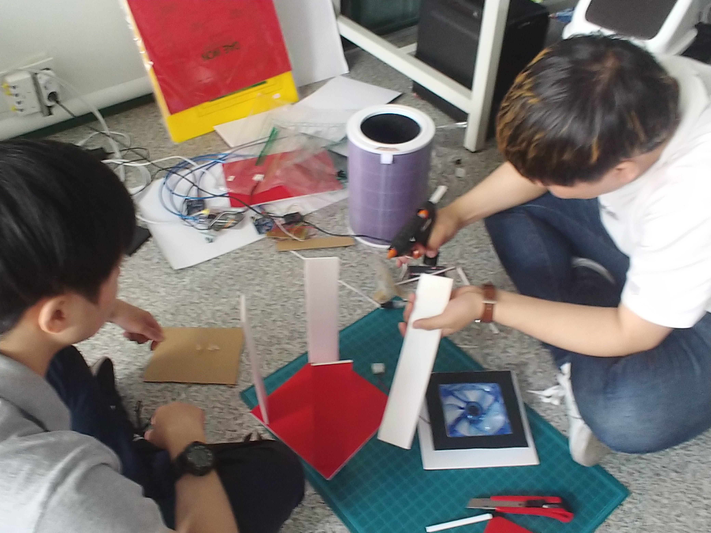
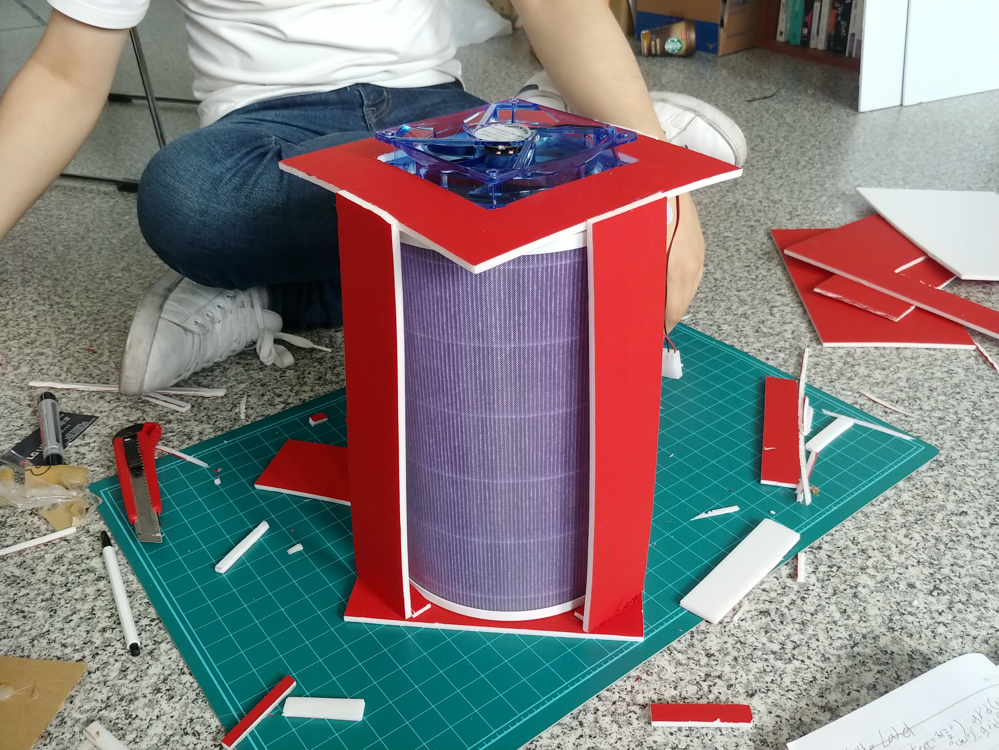
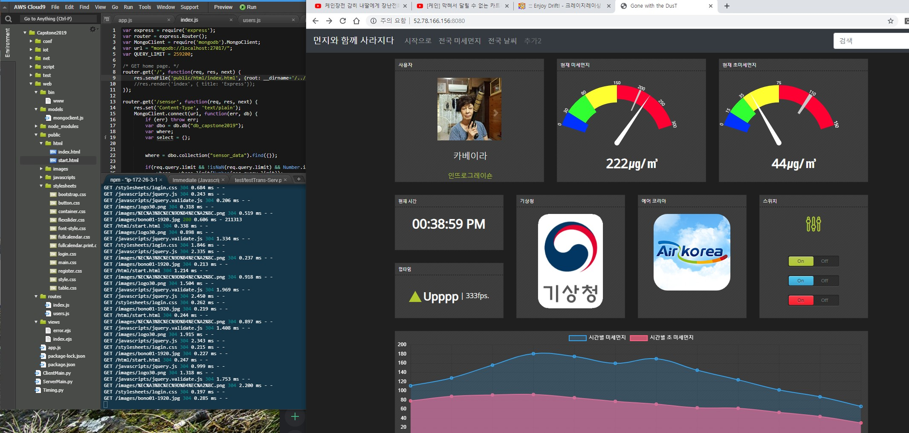
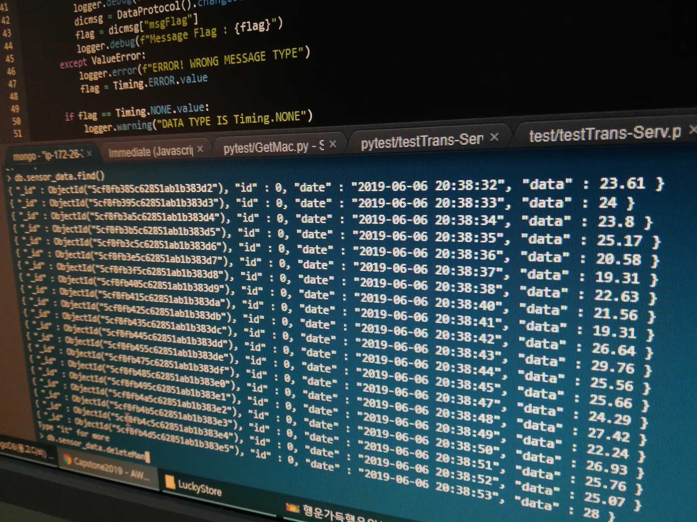
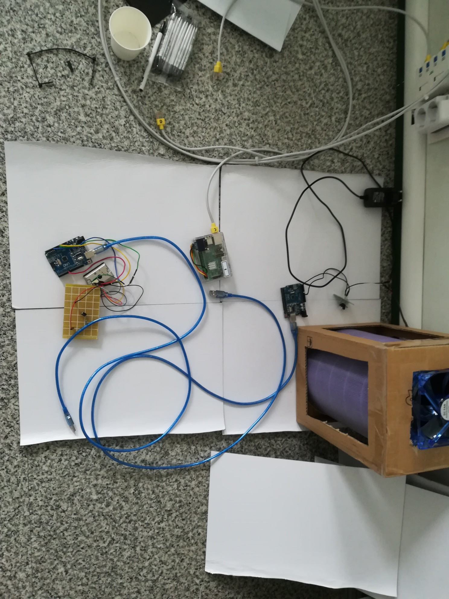
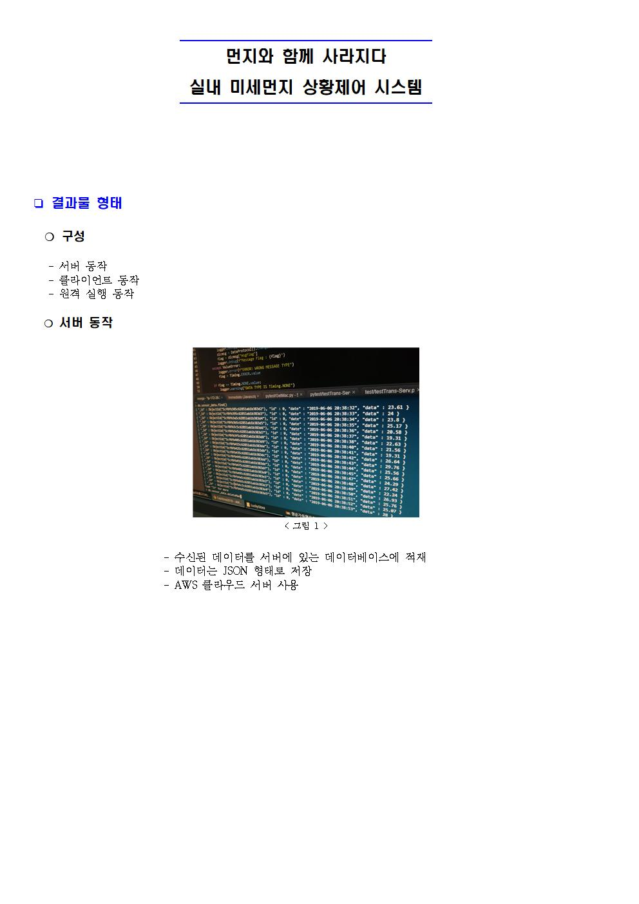
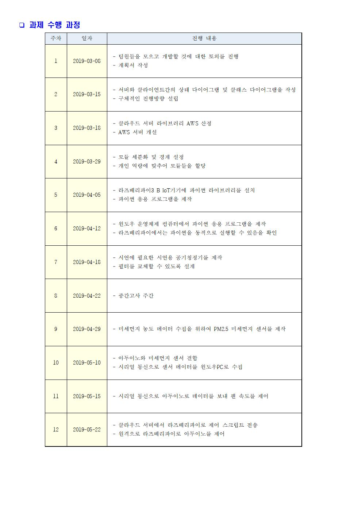
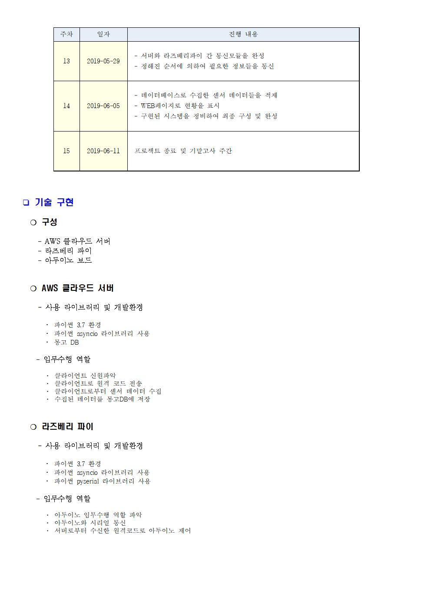
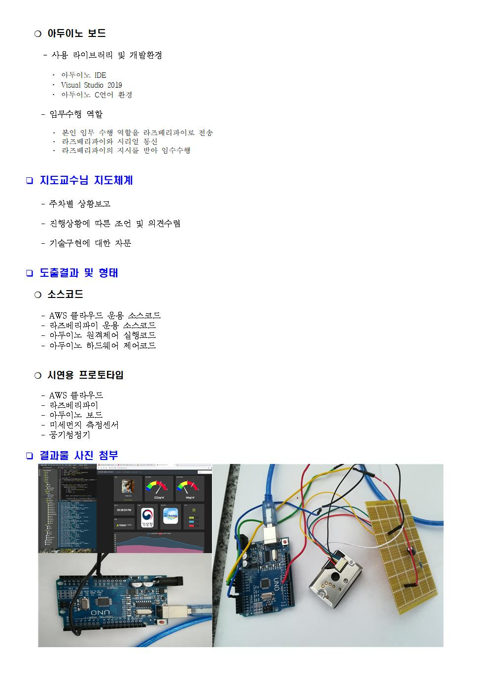

# 먼지와 함께 사라지다  
IoT기기를 위한 클라우드 기반 실내 환경 관리 플랫폼

# 프로젝트 설명 #
- 아두이노와 미세먼지 센서를 통해 센서 데이터를 서버로 송신
- 센서데이터 기반으로 공기청정기의 작동 여부를 조정
- 서버로 부터 받은 스크립트파일을 라즈베리파이에서 파이선에서 제공하는 complie 기능을 사용하여 실행
- 서버는 mongodb를 사용하여 센서데이터를 저장

# 담당 파트 #
- nodejs와 express를 사용하여 서버구축
- 서버-클라이언트 파이선 통신프로그램
- mongodb를 사용한 데이터 저장 및 관리

# 관련 내용 #

